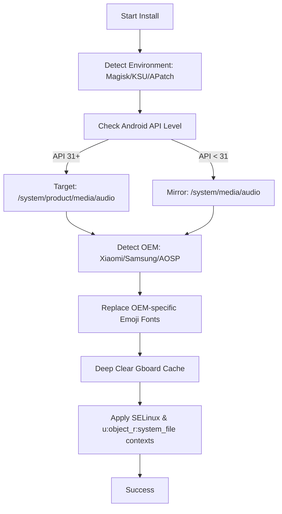

# 🍎 iOS Sounds & Emojis for Android (Pro Magisk Module)

A high-performance system-level modification module that brings the premium iOS auditory and visual experience to any rooted Android device. Built with robustness and compatibility in mind, this module uses intelligent installation scripts to ensure zero-risk deployment.

## 🛠️ Intelligent Installation Engine (`customize.sh`)

Unlike generic sound packs, this module features a sophisticated installation logic that adapts to your device's environment.

### Deployment Logic

### Key Technical Features

| Feature | Description |
| :--- | :--- |
| **OEM Detection** | Automatically detects and replaces fonts like `MiuiColorEmoji.ttf` or `SamsungColorEmoji.ttf` to ensure emojis work in all apps. |
| **Dual-Path Shield** | Mirrors sound files across `/product` and legacy `/system` paths for maximum ROM compatibility. |
| **SELinux Compliance** | Enforces correct `u:object_r:system_file:s0` contexts, preventing "silent boot" issues common in modern Android versions. |
| **OverlayFS Support** | Integrated support for `magisk_overlayfs` for devices with restricted partitions. |

## 📦 What's Included
- **UI Sounds**: Complete iOS sound set (Lock, Charging, Keyboard Taps, Camera, etc.).
- **Emojis**: Latest iOS emoji set with high-resolution Noto-compatible rendering.
- **Typography**: Apple's **SF Pro Display** fonts integrated into the system font stack.

## 🚀 Installation
1. Download the latest `.zip` release.
2. Flash via **Magisk Manager**, **KernelSU**, or **APatch**.
3. Reboot and enjoy.

---
> [!IMPORTANT]
> This module clears the Gboard cache during installation to force the refresh of the emoji picker. You may need to wait a few seconds on the first keyboard launch.

**Sentinel Data Solutions** | *Mobile Experience Engineering*
**Developed by Zeca**
