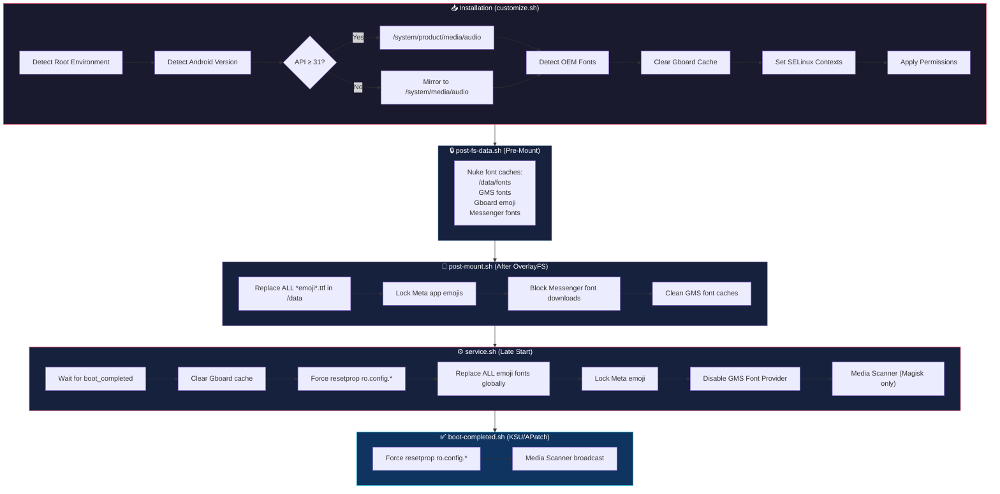

# 🍎 Sound & Emoji iOS — Magisk / KernelSU / KernelSu Next Module

<p align="center">
  
  
  
</p>

<p align="center">
  <a href="https://github.com/topjohnwu/Magisk"></a>
  <a href="https://github.com/tiann/KernelSU"></a>
  <a href="https://github.com/bmax121/APatch"></a>
</p>

<p align="center">
  <b>A high-performance system-level module that brings the complete iOS auditory and visual experience to any rooted Android device.</b>
</p>

<p align="center">
  iOS Sounds • iOS Emojis • SF Pro Display Font • Multi-Root Support
</p>

---

## 📋 Table of Contents

- [Overview](#-overview)
- [Features](#-features)
- [What's Included](#-whats-included)
- [Compatibility](#-compatibility)
- [Installation](#-installation)
- [Architecture & Boot Lifecycle](#-architecture--boot-lifecycle)
- [Script Details](#-script-details)
- [Project Structure](#-project-structure)
- [OEM Emoji Support](#-oem-emoji-support)
- [Meta / Facebook Emoji Fix](#-meta--facebook-emoji-fix)
- [Known Limitations](#-known-limitations)
- [OTA Updates](#-ota-updates)
- [Troubleshooting](#-troubleshooting)
- [Changelog](#-changelog)
- [Credits](#-credits)

---

## 🔍 Overview

**Sound_And_Emoji_IOS** is a comprehensive Android root module that systemlessly replaces:

1. **All system sounds** (UI, ringtones, notifications, alarms) with authentic iOS audio
2. **System-wide emojis** with the latest iOS emoji font (including OEM-specific replacements)
3. **System typography** with Apple's **SF Pro Display** font family

The module uses an intelligent multi-stage boot pipeline to ensure 100% persistence across reboots, ROM updates, and aggressive Google Play Services font re-downloads.

---

## ✨ Features

| Feature | Description |
| :--- | :--- |
| 🔊 **Complete iOS Sound Set** | 43 audio files covering UI, ringtones, notifications, alarms, camera, NFC, charging, and more |
| 😀 **iOS Emoji Replacement** | System-wide emoji override with latest iOS emoji font (~30MB high-res) |
| 🔤 **SF Pro Display Font** | 16 font weights (Regular to Ultralight, with Italic variants) |
| 🏭 **OEM Detection** | Auto-detects Samsung, Xiaomi, LG, HTC, OnePlus, Huawei emoji fonts |
| 📱 **Dual-Path Installation** | Installs to both `/system/product/` and `/system/media/` for max ROM compatibility |
| 🔒 **SELinux Compliant** | Full `u:object_r:system_file:s0` context enforcement + custom SEPolicy rules |
| 🔄 **Anti-Revert System** | Blocks Google Play Services from re-downloading stock emoji fonts |
| 📘 **Meta App Fix** | Replaces Facebook, Instagram, and Messenger emoji with iOS versions |
| 🪵 **Built-in Logging** | Detailed `service.log` for debugging |
| ♻️ **OverlayFS Support** | Integrated support for `magisk_overlayfs` module |
| 🔁 **Auto-Update** | In-app update support via `updateJson` |

---

## 📦 What's Included

### 🔊 Sounds (43 files)

<details>
<summary><b>UI Sounds (30 files)</b></summary>

| Sound | File |
| :--- | :--- |
| Lock Screen | `Lock.ogg` |
| Unlock Screen | `Unlock.ogg` |
| Keyboard Standard | `KeypressStandard.ogg` |
| Keyboard Spacebar | `KeypressSpacebar.ogg` |
| Keyboard Delete | `KeypressDelete.ogg` |
| Keyboard Return | `KeypressReturn.ogg` |
| Keyboard Invalid | `KeypressInvalid.ogg` |
| Camera Click | `camera_click.ogg`, `CameraClick.ogg` |
| Camera Focus | `camera_focus.ogg`, `CameraFocus.ogg` |
| Screenshot | `screenshot.ogg` |
| Video Record Start | `VideoRecord.ogg` |
| Video Record Stop | `VideoStop.ogg` |
| Charging Started | `ChargingStarted.ogg` |
| Charging Stopped | `ChargingStopped.ogg` |
| Wireless Charging | `WirelessChargingStarted.ogg` |
| Low Battery | `LowBattery.ogg` |
| NFC Success | `NFCSuccess.ogg` |
| NFC Failure | `NFCFailure.ogg` |
| NFC Transfer Complete | `NFCTransferComplete.ogg` |
| NFC Transfer Initiated | `NFCTransferInitiated.ogg` |
| NFC Initiated | `NFCInitiated.ogg` |
| Smart Lock (Trusted) | `Trusted.ogg` |
| Dock | `Dock.ogg` |
| Undock | `Undock.ogg` |
| Volume Incremental | `VolumeIncremental.ogg` |
| Media Volume | `Media_Volume.ogg` |
| Effect Tick | `Effect_Tick.ogg` |
| In-Call Notification | `InCallNotification.ogg` |

</details>

<details>
<summary><b>Notifications (7 files)</b></summary>

| Sound | File |
| :--- | :--- |
| Default Message | `IOSDefaultMessageNotification.ogg` |
| Calendar Alert | `IOSCalendarAlert.ogg` |
| New Mail | `IOSNewMail.ogg` |
| Reminder Alert | `IOSReminderAlert.ogg` |
| Sent Message | `IOSSentMessage.ogg` |
| iOS Notification 0 | `Ios Notification 0.ogg` |
| iOS Notification 1 | `Ios Notification 1.ogg` |

</details>

<details>
<summary><b>Ringtones (3 files)</b></summary>

| Sound | File |
| :--- | :--- |
| Default (Reflection) | `IOSDefaultRingtone.ogg` |
| Reflection | `IOSReflection.ogg` |
| Sashimi | `IOSSashimi.ogg` |

</details>

<details>
<summary><b>Alarms (3 files)</b></summary>

| Sound | File |
| :--- | :--- |
| Default Alarm | `IOSDefaultAlarm.ogg` |
| Bedtime | `IOSBedtimeAlarm.ogg` |
| Nightstand | `IOSNightstandAlarm.ogg` |

</details>

### 😀 Emoji Fonts (2 files)

| Font | Size | Purpose |
| :--- | :--- | :--- |
| `NotoColorEmoji.ttf` | ~30 MB | System-wide emoji replacement (AOSP/Pixel) |
| `FacebookEmoji.ttf` | ~30 MB | Meta apps emoji replacement (FB, IG, Messenger) |

### 🔤 SF Pro Display (16 font weights)

| Weight | Regular | Italic |
| :--- | :--- | :--- |
| Ultralight | ✅ | ✅ |
| Thin | ✅ | ✅ |
| Light | ✅ | ✅ |
| Regular | ✅ | ✅ |
| Medium | ✅ | ✅ |
| Semibold | ✅ | ✅ |
| Bold | ✅ | ✅ |
| Heavy | ✅ | ✅ |

---

## 🔧 Compatibility

### Root Solutions

| Platform | Version | Status |
| :--- | :--- | :--- |
| **Magisk** | 20.0+ | ✅ Full Support |
| **KernelSU** | All | ✅ Full Support (requires metamodule) |
| **KernelSU Next** | 20000+ | ✅ Full Support (requires metamodule) |
| **APatch** | All | ✅ Full Support |

### Android Versions

| Android | API | Status | Notes |
| :--- | :--- | :--- | :--- |
| Android 11 | API 30 | ✅ | Legacy path (`/system/media/audio`) |
| Android 12 | API 31 | ✅ | Product path (`/system/product/media/audio`) |
| Android 12L | API 32 | ✅ | — |
| Android 13 | API 33 | ✅ | — |
| Android 14 | API 34 | ✅ | resetprop fallback for `ro.config.*` |
| Android 15 | API 35 | ✅ | resetprop fallback for `ro.config.*` |
| Android 16 | API 36 | ✅ | resetprop fallback for `ro.config.*` |

### Tested ROMs

Works on AOSP, Pixel, LineageOS, crDroid, EvolutionX, AxionOS, MIUI, HyperOS, OneUI, OxygenOS, ColorOS, and more.

> [!IMPORTANT]
> **KernelSU / KernelSU Next users:** You **MUST** install a metamodule (e.g., `meta-overlayfs`) for the module to mount files into `/system/`. The installer will warn you if none is detected.

---

## 🚀 Installation

1. Download the latest `Sound_And_Emoji_IOS.zip` from [Releases](https://github.com/antoniomalheirs/Sound_And_Emoji_IOS/releases)
2. Open your root manager (**Magisk Manager**, **KernelSU Manager**, or **APatch**)
3. Flash the `.zip` via the **Modules** → **Install from storage** option
4. **Reboot** your device
5. Enjoy the iOS experience! 🎉

> [!NOTE]
> The module clears the Gboard emoji cache during installation. You may notice a brief delay on the first keyboard launch after reboot while Gboard rebuilds its emoji index.

---

## 🏗️ Architecture & Boot Lifecycle

The module uses a sophisticated multi-stage boot pipeline to ensure everything works across all root solutions and Android versions:



### Why Multiple Stages?

| Stage | Timing | Purpose |
| :--- | :--- | :--- |
| `post-fs-data.sh` | Before module mount | Clean caches BEFORE system reads them |
| `post-mount.sh` | After OverlayFS mount | Replace app emoji files while apps haven't started |
| `service.sh` | Late start (boot completed) | Force properties, disable GMS, media scan |
| `boot-completed.sh` | After `sys.boot_completed=1` (KSU/APatch) | Re-apply properties that system may have overwritten |

---

## 📜 Script Details

### `customize.sh` — Installation Engine

The installation script adapts to the device environment:

- **Root Detection:** Identifies Magisk, KernelSU, KernelSU Next, or APatch
- **Metamodule Check (KSU):** Warns if `meta-overlayfs` or similar is not installed
- **API-Based Path Selection:** Uses `/system/product/` for Android 12+ or mirrors to `/system/media/` for Android 11
- **OEM Emoji Detection:** Scans `/system/fonts/` for manufacturer-specific emoji fonts and creates replacements only for fonts that actually exist
- **Gboard Cache Cleanup:** Removes cached emoji data so Gboard picks up the new font
- **OverlayFS Integration:** Detects and supports `magisk_overlayfs` for restricted partitions
- **SELinux Enforcement:** Applies `u:object_r:system_file:s0` context to all installed files

### `post-fs-data.sh` — Pre-Mount Cache Nuker

Runs BEFORE the module is mounted. Has a strict 10-second timeout.

- Deletes `/data/fonts/` (system font updates)
- Cleans GMS font provider caches
- Clears Gboard emoji caches
- Removes Messenger font download directories

### `post-mount.sh` — Emoji Lock (KSU/APatch)

Runs AFTER OverlayFS/MagicMount has mounted module files.

- **Nuclear font replacement:** Finds ALL `*emoji*.ttf` files in `/data/data/` and `/data/user/0/` and replaces them with the iOS emoji font
- **Meta app lock:** Creates/replaces `FacebookEmoji.ttf` in each Meta app's `app_ras_blobs/` directory with correct ownership and immutable flag
- **Messenger block:** Sets `chmod 000` on Messenger's font download directory
- **GMS cleanup:** Removes cached font files from Google Play Services

### `service.sh` — Late Start Service (Universal)

The main runtime script. Waits for `sys.boot_completed=1` before executing.

- **resetprop:** Force-sets 25+ `ro.config.*` sound properties that Android 14+ may overwrite during boot
- **Global emoji replacement:** Scans ALL app directories for emoji font files and replaces them
- **Meta emoji lock:** Replaces and locks emoji fonts in Facebook, Instagram, Messenger (+ Lite variants) with `chmod 444`
- **GMS Font Provider disable:** Disables `FontsProvider` and `UpdateSchedulerService` in Google Play Services to prevent stock emoji re-download
- **Media Scanner (Magisk):** Broadcasts `MEDIA_SCANNER_SCAN_FILE` intents for all audio files so they appear in Android's sound picker

### `boot-completed.sh` — Post-Boot Hook (KSU/APatch)

KernelSU and APatch support this hook natively. Provides a clean way to re-apply properties after the system is fully booted.

- Re-applies all `ro.config.*` sound properties via `resetprop`
- Triggers media scanner for ringtones, notifications, and alarms

### `sepolicy.rule` — SELinux Policy

Custom SEPolicy rules that allow:

- `mediaserver` and `audioserver` to read module-mounted audio files
- Untrusted apps (Facebook/Messenger) to read bind-mounted emoji fonts
- Platform apps (Gboard) and GMS to read system emoji fonts

### `system.prop` — System Properties

Declares default ringtone, notification, and alarm properties. Kept for backwards compatibility with older Android versions where `system.prop` is reliably applied during boot.

### `uninstall.sh` — Clean Removal

Removes the module directory from `/data/adb/modules/` on uninstallation.

---

## 📂 Project Structure

```
Sound_And_Emoji_IOS/
├── META-INF/                          # Flashable ZIP metadata
│   └── com/google/android/
│       ├── update-binary             # Magisk module installer
│       └── updater-script            # Required (empty marker)
│
├── system/
│   ├── fonts/                         # Font replacements
│   │   ├── NotoColorEmoji.ttf        # iOS emoji font (system-wide)
│   │   ├── FacebookEmoji.ttf         # iOS emoji for Meta apps
│   │   ├── SF-Pro-Display-Regular.ttf
│   │   ├── SF-Pro-Display-Bold.ttf
│   │   ├── SF-Pro-Display-Medium.ttf
│   │   ├── SF-Pro-Display-Semibold.ttf
│   │   ├── SF-Pro-Display-Light.ttf
│   │   ├── SF-Pro-Display-Thin.ttf
│   │   ├── SF-Pro-Display-Heavy.ttf
│   │   ├── SF-Pro-Display-Ultralight.ttf
│   │   └── ... (+ italic variants)
│   │
│   └── product/media/audio/          # iOS sound files
│       ├── ui/                        # 30 UI sounds
│       ├── notifications/             # 7 notification sounds
│       ├── ringtones/                 # 3 ringtones
│       └── alarms/                    # 3 alarm sounds
│
├── webroot/
│   └── index.html                    # Module manager web UI redirect
│
├── update_metada/
│   ├── update.json                   # OTA update manifest
│   └── CHANGELOG.md                  # Full version history
│
├── customize.sh                      # Installation script
├── post-fs-data.sh                   # Pre-mount cache cleaner
├── post-mount.sh                     # Post-mount emoji lock (KSU/APatch)
├── service.sh                        # Late start service (universal)
├── boot-completed.sh                 # Post-boot hook (KSU/APatch)
├── sepolicy.rule                     # Custom SELinux policies
├── system.prop                       # Default sound properties
├── uninstall.sh                      # Cleanup on removal
└── module.prop                       # Module metadata
```

---

## 🏭 OEM Emoji Support

The module automatically detects and replaces manufacturer-specific emoji fonts. It only creates replacement files for fonts that **actually exist** on your device:

| OEM | Font File | Devices |
| :--- | :--- | :--- |
| Samsung | `SamsungColorEmoji.ttf` | Galaxy S, A, Note, Z series |
| Xiaomi | `MiuiColorEmoji.ttf` | Mi, Redmi, POCO (MIUI/HyperOS) |
| LG | `LGNotoColorEmoji.ttf` | LG V, G series |
| HTC | `HTC_ColorEmoji.ttf` | HTC U, Desire series |
| OnePlus | `OnePlusEmoji.ttf` | OnePlus, OPPO, Realme |
| Huawei | `HuaweiColorEmoji.ttf` | Huawei, Honor |
| AOSP/Pixel | `NotoColorEmoji.ttf` | Pixel, AOSP-based ROMs |

---

## 📘 Meta / Facebook Emoji Fix

Meta apps (Facebook, Instagram, Messenger) use their own bundled emoji font (`FacebookEmoji.ttf`) instead of the system font. The module uses an **aggressive multi-layer approach** to force iOS emojis:


### Targeted Apps

| App | Package | Status |
| :--- | :--- | :--- |
| Facebook | `com.facebook.katana` | ✅ iOS Emojis |
| Messenger | `com.facebook.orca` | ✅ iOS Emojis |
| Facebook Lite | `com.facebook.lite` | ✅ iOS Emojis |
| Messenger Lite | `com.facebook.mlite` | ✅ iOS Emojis |
| Instagram | `com.instagram.android` | ✅ iOS Emojis |
| InstaPro | `com.instapro.android` | ✅ iOS Emojis |

---

## ⚠️ Known Limitations

### WhatsApp Emojis

WhatsApp **does not use the system emoji font** (`NotoColorEmoji.ttf`). Instead, WhatsApp bundles its own proprietary emoji set directly inside the APK to maintain visual consistency across Android, iOS, and Web platforms. This is a deliberate architectural decision by Meta.

**What this means:**
- ✅ System UI, Gboard, SMS, Chrome, and most apps → **iOS emojis work perfectly**
- ✅ Facebook, Instagram, Messenger → **iOS emojis work** (replaced via module)
- ❌ WhatsApp → **uses its own emojis** (cannot be changed without modifying the APK)

> [!NOTE]
> This is **not a bug in the module** — it is a WhatsApp limitation. The only way to change WhatsApp's emojis would be to use a modified APK (which violates WhatsApp's Terms of Service and may result in account suspension).

### Telegram

Telegram has its own emoji rendering system that can be configured in-app. Check **Settings → Chat Settings → Emoji** to use system emojis.

---

## 🔄 OTA Updates

The module supports in-app updates via the `updateJson` mechanism. Your root manager will automatically check for new versions.

**Update URL:** `https://raw.githubusercontent.com/antoniomalheirs/Sound_And_Emoji_IOS/main/update_metada/update.json`

---

## 🔧 Troubleshooting

<details>
<summary><b>Sounds not changing after reboot</b></summary>

1. Check if `service.log` exists in the module directory (`/data/adb/modules/Sound_And_Emoji_IOS/service.log`)
2. Verify that `resetprop` is working: run `getprop ro.config.ringtone` — it should show `IOSDefaultRingtone.ogg`
3. On Android 14+, the system may override `system.prop` — the module uses `resetprop` as fallback via `service.sh` and `boot-completed.sh`
4. Clear your Settings app cache and check sound settings again

</details>

<details>
<summary><b>Emojis not changing in Gboard</b></summary>

1. Clear Gboard app data: **Settings → Apps → Gboard → Clear Data**
2. Reboot the device
3. Check if `/data/fonts/` directory was removed (it should not exist)
4. Verify the module is enabled in your root manager

</details>

<details>
<summary><b>Facebook/Instagram still showing old emojis</b></summary>

1. Force-stop the app
2. Check `service.log` for errors
3. Verify that the emoji file has read-only permissions: `ls -l /data/data/com.facebook.katana/app_ras_blobs/FacebookEmoji.ttf` — should show `-r--r--r--`
4. If not, reboot — the module re-applies on every boot

</details>

<details>
<summary><b>Sounds/Ringtones not appearing in Settings picker</b></summary>

1. The module triggers MediaScanner after boot — wait ~15 seconds after reboot
2. If still not visible, check if your ROM reads from `/system/product/media/audio/` or `/system/media/audio/`
3. Try clearing the MediaProvider cache: **Settings → Apps → Media Storage → Clear Data** → Reboot

</details>

<details>
<summary><b>KernelSU: Nothing is working</b></summary>

1. **You MUST install a metamodule** (e.g., `meta-overlayfs`) for KernelSU to mount files into `/system/`
2. The installer will show a warning if no metamodule is detected
3. Install `meta-overlayfs` → Reboot → Re-flash this module → Reboot again

</details>

---

## 📝 Changelog

See the full changelog at [`update_metada/CHANGELOG.md`](update_metada/CHANGELOG.md).

### Latest: v1.4.7

- **Keyboard Flicker Fix (AOSP/Custom ROMs):** Excluded keyboard apps (SwiftKey, Gboard) from internal font replacement. This stops the keyboard from crashing when opening the emoji panel to reply to an Instagram Story.

### Previous: v1.4.6

- **HyperOS Instagram Stories Crash Fix:** Changed permissions of `FacebookEmoji.ttf` to `644` to prevent an unhandled permission exception during Instagram's font validation checks.
- **Meta Emoji Watcher Daemon:** Added an ultra-lightweight background daemon to `service.sh` that actively watches for Instagram's attempts to revert the iOS emojis and silently restores them.

### Previous: v1.4.5

- **Stories Keyboard Crash Fix:** Changed the SELinux context of the Instagram emoji font from `app_data_file` to `system_file`. This allows third-party keyboards (like SwiftKey/Gboard) to read the font when passed by the Instagram Stories editor, preventing the keyboard from crashing and flickering.
- **HyperOS/Dual Apps Support:** Scans all user profiles (`/data/user/*`) to ensure Instagram and other Meta apps in Dual Apps have their emojis replaced correctly.
- **Messenger font block:** Blocks the font download directory (`files/fonts`) for Messenger across all user profiles (`/data/user/*`) to prevent silent redownloads.
- **Crash Fix:** Removed `chattr +i` (immutable flag) from emoji files to prevent Instagram from crashing.

---

## 👏 Credits

| Contributor | Contribution |
| :--- | :--- |
| [**topjohnwu**](https://github.com/topjohnwu) | Creator of Magisk |
| [**tiann**](https://github.com/tiann) | Creator of KernelSU |
| [**TheGabrielHoward**](https://github.com/TheGabrielHoward/IOS-sounds/tree/master) | Original iOS sounds and module inspiration |
| [**dtingley11**](https://github.com/dtingley11/KernelSU-iOS-Emoji) | OEM font replacement code |

---

<p align="center">
  <b>Sentinel Data Solutions</b> | <i>Mobile Experience Engineering</i><br/>
  <b>Developed by Zeca</b>
</p>

<p align="center">
  ⭐ If this module improved your Android experience, consider giving the repo a star!
</p>
